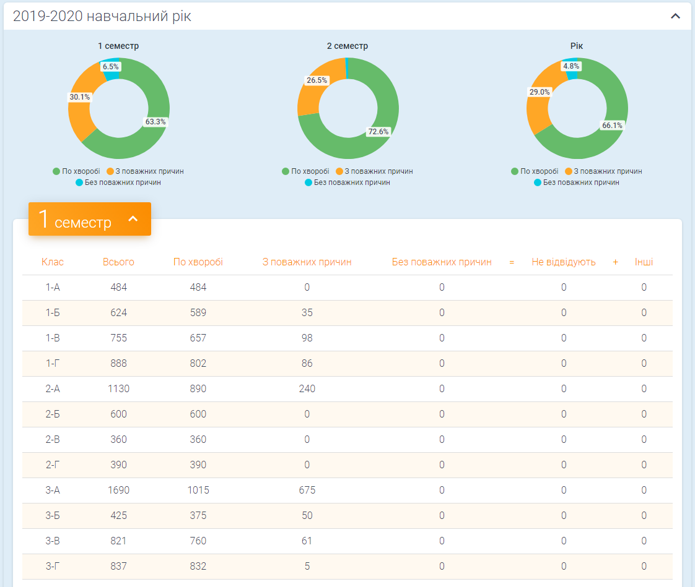
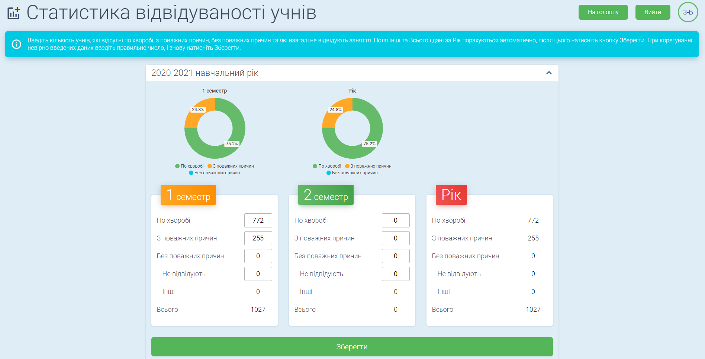

# Статистика посещаемости учеников

### Демо главной страницы
[http://attendance.stroinova.mk.ua/](http://attendance.stroinova.mk.ua/)




### Установка
Скачайте проект и запустите команду
```sh
npm i
```

Запуск локального сервера:
```sh
npm run start
```

Сборка:
```sh
npm run build
```

### Доступ на страницу классного руководителя
Логин - Test, пароль - test (приложение работает с тестовым API и базой данных, поэтому в кабинете можно смело совершать любые действия - добавлять/редактировать/сохранять).

Примечание: в этот аккаунт можно зайти только с локально запущенного сервера (npm run start). На реальном сайте, указанном в демо, этого аккаунта не существует.

### Описание

Приложение предназначено для заполнения количества отсутствовавших по тем или иным причинам учеников по каждому классу, и последующего отображения статистики в виде таблиц и круговых диаграмм.

Каждый классный руководитель имеет доступ к личному кабинету своего класса, где в конце семестра заполняет соответствующую форму (1-го или 2-го семестра), вводя количество отсутствовавших учеников за семестр по причинам болезни, уважительным причинам, без уважительных причин и которые не посещают совсем. 
Значение "Без уважительных причин" (Без поважних причин) является суммой значений "Не посещают" (Не відвідують) и "Другие" (Інші).

Значения Другие и Всего (Всього) считаются автоматически.
Значения за год также считаются автоматически суммированием значений 1-го и 2-го семестров. В конце 1-го семестра годовые значения одинаковы со значениями 1-го семестра, так как данных за 2-ой семестр еще нет и они приравниваются к нулям.

После ввода значений и их сохранения на сервере нажатием кнопки Сохранить (Зберегти), отображаются 3 круговые диаграммы – за 1 и 2 семестры и за год. В конце 1-го семестра отображаются 2 диаграммы – за 1 семестр и за год. Каждая диаграмма отображает в процентах 3 значения – По болезни (По хворобі), По уважительным причинам (З поважних причин) и Без уважительных причин.

В личном кабинете доступны для заполнения/редактирования формы за текущий и предыдущий учебные годы.

На главной странице в таблицах отображаются данные, которые были сохранены, а также строка Всего (Всього), в которой отображаются суммы соответствующих значений всех классов. Диаграммы на главной странице отображают 3 значения из строки Всего.
